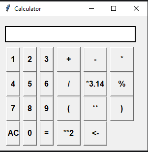

# Calculator Application

This is a calculator application built using Python's Tkinter library. It allows users to perform basic arithmetic
operations and evaluate mathematical expressions.

## Features

- **Basic Operations**: Supports addition, subtraction, multiplication, and division.
- **Advanced Functions**: Includes operations like multiplication by π (3.14), percentage, power, and parentheses for
  complex expressions.
- **Undo Functionality**: Users can undo the last action.
- **Clear Display**: A clear button to reset the input.
- **User-friendly Interface**: Intuitive layout with buttons for numbers and operations.

## Requirements

- Python 3.x
- Tkinter

## Usage

- **Entering Numbers**: Click on the number buttons to enter digits into the display.
- **Entering Operations**: Click on the operation buttons to perform calculations (e.g., +, -, *, /).
- **Calculating Result**: Press the = button to evaluate the expression and display the result.
- **Clearing Display**: Press the AC button to clear all entries in the display.
- **Undo Action**: Use the <- button to remove the last character entered.
- **Advanced Operations**: Use *3.14 for multiplication by π and % for percentage calculations.

## Code Overview

### The calculator is implemented using the following key functions:

- **get_number(num)**: Inserts a number into the display.
- **get_operation(operator)**: Inserts an operation into the display.
- **clear_all()**: Clears the display.
- **calculate()**: Evaluates the mathematical expression and displays the result or an error message if the expression
  is invalid.
- **undo()**: Removes the last character from the display.

#### The application interface is created using Tkinter's Entry and Button widgets, arranged in a grid layout.

